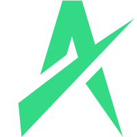

  

<h1 align="center">
  
</h1>

  <em>You can call me TinyCat! 🐾</em>

  
  

---

## 🦄 About Me

Hey! I'm a Senior Frontend & Blockchain dev who loves coding and magic. Let's build something cool together! 🚀

#### Read my blog:
[https://aniadev.github.io](https://aniadev.github.io/)

---

## ⚡ Tech Stacks

### 💻 Languages & Blockchain

### 🎨 Frontend Fun

### ⚙️ Backend & Databases

### 🛠️ Infrastructure & Tools

---

## 📊 My Stats

  
  

---

## 🎯 Current Missions

*   🤖 Leveling up Web3 & Frontend skills.
*   🧠 Learning product management & business analysis stuff.
*   🌟 Making open-source fun!

---

## 💌 Let's Chat!

*   LinkedIn: [phamhai99](https://www.linkedin.com/in/phamhai99)
*   X: [Ania](https://x.com/haiph_9)

---

  

  <em>⭐ Drop a star if you like my work! ❤️ by Ania</em>

